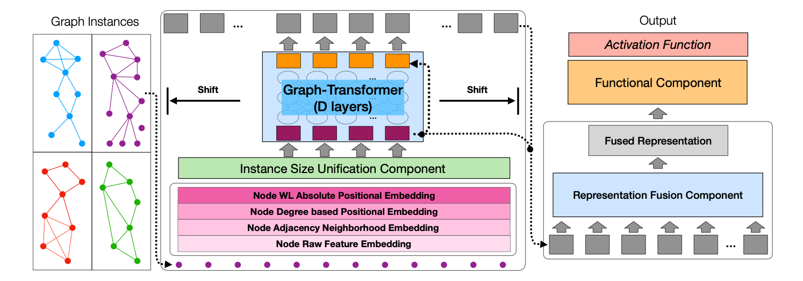

# SEG-BERT (Segmented GRAPH-BERT)



## Source code of "Segmented GRAPH-BERT Model"

### Paper URL

The preprints of papers using SEG-BERT on graph classification and graph distance metric learning can be accessed via the following links<br>
Paper 1 IFM Lab URL: http://www.ifmlab.org/files/paper/segmented_graph_bert.pdf  <br>
Paper 2 IFM Lab URL: http://www.ifmlab.org/files/paper/graph_bert_neural_distance.pdf <br>

Paper 1 arXiv URL: https://arxiv.org/abs/2002.03283 <br>
Paper 2 arXiv URL: https://arxiv.org/abs/2002.03427 <br>

### Reference Paper

This is a follow-up work of "Graph-Bert: Only Attention is Needed for Learning Graph Representations".<br>
The readers are also suggested to refer to that paper and its source code for more information<br>
Reference Paper URL: https://arxiv.org/abs/2001.05140  <br>
Reference Github URL: https://github.com/jwzhanggy/Graph-Bert  <br>

### Graph-Bert Paper List

A list of the latest research papers on graph-bert can be found via the following link<br>
Page URL: https://github.com/jwzhanggy/graph_bert_work

### Graph Neural Networks from IFM Lab

The latest graph neural network models proposed by IFM Lab can be found via the following link<br>
IFM Lab GNNs: https://github.com/jwzhanggy/IFMLab_GNN

### More Datasets
More datasets can be downloaded via the following link, after unzip it, paste them to the data folder.<br>
https://drive.google.com/file/d/1PgTsLo_zubAFx6zwx5yQakLQcVCEKuQF/view?usp=sharing

### Reference
```
@article{zhang2020segmented,
  title={Segmented Graph-Bert for Graph Instance Modeling},
  author={Zhang, Jiawei},
  journal={arXiv preprint arXiv:2002.03283},
  year={2020}
}

@article{Zhang2020GraphND,
  title={Graph Neural Distance Metric Learning with Graph-Bert},
  author={Jiawei Zhang},
  journal={ArXiv},
  year={2020},
  volume={abs/2002.03427}
}
```

************************************************************************************************

## How to run the code?

### To run a script, you can just use command line: python3 script_name.py

After downloading the code, you can run
```
python3 [script_name].py
```
for graph pre-processing, classification and evaluation.

### What are the scripts used for?

(1) The Graph-Bert model takes (a) node WL code, (b) intimacy based subgraph batch, (c) node hop distance as the prior inputs. These can be computed with the script_preprocess.py.

(2) script_graph_classification.py includes the script for graph instance classification with full input and padding/pruning strategies in SEG-Bert.

(3) script_segmented_graph_classification.py provides the script for graph instance classification with segment shifting strategy in SEG-Bert.

(4) script_evaluation_plots.py is used for plots drawing and results evaluation purposes.

### How to turn on/off the blocks?

You can change the "if 0" to "if 1" to turn on a script block, and the reverse to turn off a script block.

### Several toolkits may be needed to run the code
(1) pytorch (https://anaconda.org/pytorch/pytorch)
(2) sklearn (https://anaconda.org/anaconda/scikit-learn) 
(3) transformers (https://anaconda.org/conda-forge/transformers) 
(4) networkx (https://anaconda.org/anaconda/networkx) 


************************************************************************************************

## Organization of the code?

A simpler template of the code is also available at http://www.ifmlab.org/files/template/IFM_Lab_Program_Template_Python3.zip

### The whole program is divided into five main parts:

(1) data.py (for data loading and basic data organization operators, defines abstract method load() )

(2) method.py (for complex operations on the data, defines abstract method run() )

(3) result.py (for saving/loading results from files, defines abstract method load() and save() )

(4) evaluate.py (for result evaluation, defines abstract method evaluate() )

(5) setting.py (for experiment settings, defines abstract method load_run_save_evaluate() )

The base class of these five parts are defined in ./code/base_class/, they are all abstract class defining the templates and architecture of the code.

The inherited class are provided in ./code, which inherit from the base classes, implement the abstract methonds.

************************************************************************************************

